# Architecture & Technical Design Document - DevFestVerse

## Overview
**DevFestVerse** is an interactive 2D pixel-art virtual event platform built for **GDG Cloud Bangkok**. Deployed on **Google Cloud Platform (Cloud Run microservices)**, it provides an immersive retro game experience featuring custom SVG agent avatars with idle bobbing animations, GDG Cloud Bangkok community billboards (social links with embedded iframe modals & new tab buttons), sponsor booths, session-linked Gemini transcriptions by speaker, workshop room seat reservations, background music (YouTube/GCS audio), and role-based access control.

---

## High-Level System Architecture Diagram

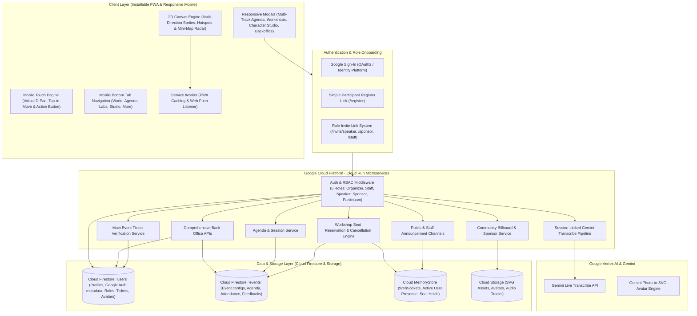

---

## Google Auth & Cloud Firestore User Management Architecture

```mermaid
sequenceDiagram
    autonumber
    actor User as Attendee / Google User
    actor Admin as Event Organizer / Staff
    participant Web as DevFestVerse Web Client
    participant GIS as Google Identity Services (OAuth2 Client)
    participant AuthAPI as Auth API (/api/v1/auth)
    participant BackofficeAPI as Backoffice API (/api/v1/backoffice/users)
    participant Firestore as Cloud Firestore ('users' collection)

    rect rgb(24, 32, 54)
    note over User,Firestore: 1. Google Authentication & Auto-Registration Flow
    User->>Web: Click "Continue with Google"
    Web->>GIS: Trigger Google One-Tap / OAuth prompt
    GIS-->>Web: Google ID Token (Credential JWT)
    Web->>AuthAPI: POST /auth/google-login { google_token, email, display_name, avatar_url }
    AuthAPI->>GIS: Verify Google ID Token against audience & public keys
    AuthAPI->>Firestore: Check 'users' collection by email
    alt Existing User
        Firestore-->>AuthAPI: Existing User Record
        AuthAPI->>Firestore: Update avatar_url & google_sub metadata
    else New Attendee
        AuthAPI->>Firestore: Create user doc { id, email, display_name, role: 'PARTICIPANT', auth_provider: 'google' }
    end
    Firestore-->>AuthAPI: Persisted User Document
    AuthAPI-->>Web: 200 OK (User Profile + Avatar Config)
    Web->>User: Welcome Toast & Enter 2D DevFest Tech Campus
    end

    rect rgb(30, 41, 59)
    note over Admin,Firestore: 2. Backoffice User Directory & Role Administration Flow
    Admin->>Web: Open Back Office -> User Management Tab
    Web->>BackofficeAPI: GET /backoffice/users (with role/search query) & GET /backoffice/users/stats
    BackofficeAPI->>Firestore: Query 'users' collection stream
    Firestore-->>BackofficeAPI: List of users & aggregated statistics
    BackofficeAPI-->>Web: 200 OK (User list & KPI counts)
    Web->>Admin: Displays live user table, Google badges & ticket statuses
    Admin->>Web: Change User Role (e.g. PARTICIPANT -> SPEAKER) or Link Ticket
    Web->>BackofficeAPI: POST /backoffice/users/{id}/role or /ticket
    BackofficeAPI->>Firestore: Update user document in 'users' collection
    Firestore-->>BackofficeAPI: OK
    BackofficeAPI-->>Web: 200 OK (Updated User)
    Web->>Admin: Toast "User role updated to SPEAKER on Firestore!"
    end
```

---

## User Role Matrix (RBAC)

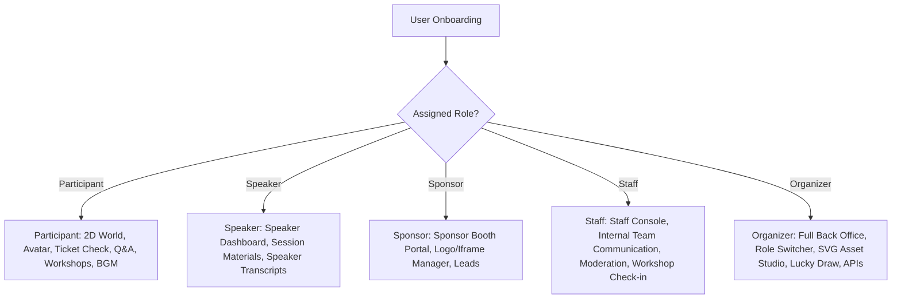

---

## Google Sign-In & Character Studio Onboarding Sequence

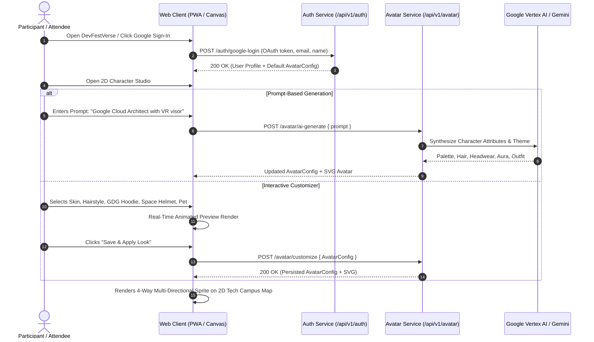

---

## Detailed Data Models & Entity Relationships

1. **User / Account (`users`)**:
   - `id`: UUID
   - `email`: String (Google OAuth)
   - `display_name`: String
   - `role`: Enum (`ORGANIZER`, `STAFF`, `SPEAKER`, `SPONSOR`, `PARTICIPANT`)
   - `verified_ticket`: Boolean (Status from Main Event Ticket Verification)
   - `ticket_ref`: String
   - `avatar_config`: JSON (`skin_tone`, `hair_style`, `hair_color`, `outfit_style`, `outfit_color`, `headwear`, `aura`, `theme`)
   - `avatar_svg`: Text (SVG avatar markup)
   - `created_at`: Timestamp

2. **Agenda Session (`sessions`)**:
   - `id`: UUID
   - `event_id`: UUID
   - `title`: String
   - `description`: Text
   - `speaker_id`: UUID (FK `users.id`)
   - `start_time`: Timestamp
   - `end_time`: Timestamp

3. **Session Transcript (`transcripts`)**:
   - `id`: UUID
   - `session_id`: UUID (FK `sessions.id`)
   - `speaker_id`: UUID (FK `users.id`)
   - `transcript_text`: Text
   - `original_language`: String (e.g. `th`, `en`)
   - `translated_text`: Text
   - `timestamp`: Timestamp

4. **Community Billboard & Sponsor (`billboards`)**:
   - `id`: UUID
   - `event_id`: UUID
   - `category`: Enum (`COMMUNITY_FACEBOOK_PAGE`, `COMMUNITY_FACEBOOK_GROUP`, `COMMUNITY_DISCORD`, `COMMUNITY_INSTAGRAM`, `COMMUNITY_YOUTUBE`, `SPONSOR`)
   - `title`: String
   - `logo_svg`: Text / URL
   - `iframe_url`: String
   - `description`: Text
   - `position_x`: Integer
   - `position_y`: Integer

5. **Workshop Room (`workshops`)**:
   - `id`: UUID
   - `event_id`: UUID
   - `title`: String
   - `speaker_name`: String
   - `capacity`: Integer
   - `reserved_count`: Integer
   - `room_code`: String

---

## Security & Authentication Flow
- **Google OAuth2 & Identity Integration**: User authenticates with Google Identity Services; backend synchronizes user account and avatar configuration.
- **Invitation Token Validation**: Organizers generate HMAC-signed token URLs (`/invite/speaker?token=...`, `/invite/sponsor?token=...`, `/invite/staff?token=...`). Redemption validates signature and updates user role in DB.

---

## Multi-Track Agenda & Personalized "My Agenda" Architecture

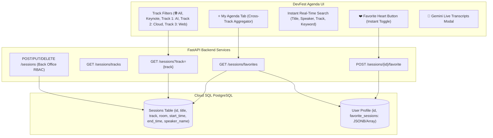

### Multi-Track & Back Office Flow Sequence

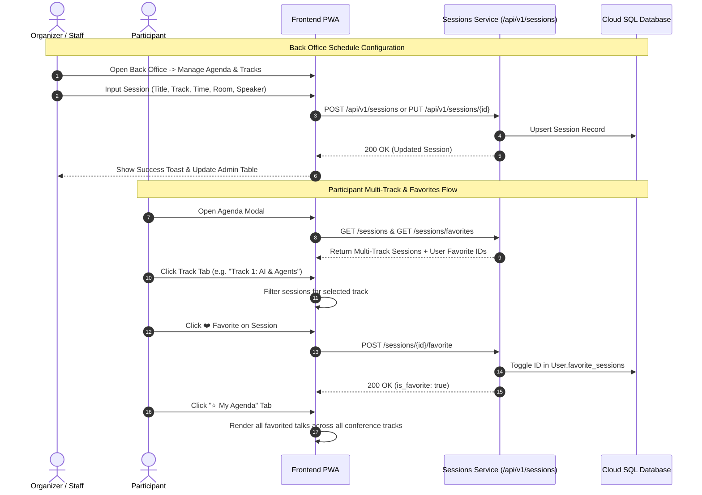

---

## Firestore Event Document Hierarchy & Attendance Tracking

The database on Google Cloud Firestore uses the **Event Name / Slug as the top-level document key** under the `events` collection.

```mermaid
graph TD
    subgraph FirestoreRoot ["Google Cloud Firestore: Collection ('events')"]
        EventDoc["Document: events/{event_id} (e.g. 'devfest-bangkok-2026')"]
    end

    subgraph EventPayload ["Top-Level Event Document Fields"]
        EventMeta["Metadata: {theme, year, organizer, expected_capacity, registration_url}"]
        EventDate["Date: '2026-11-28'"]
        EventVenue["Venue: {name, address, rooms: ['Grand Ballroom', 'Room A1', 'Room B1', ...]}"]
        EventSpeakers["Speakers: [ {id, name, title, bio, avatar_url}, ... ]"]
        EventSessions["Sessions: [ {id, title, track, room, start_time, end_time, speaker_name}, ... ]"]
        EventSponsors["Sponsors: [ {id, name, tier, booth_url, description}, ... ]"]
        EventWorkshops["Workshops: [ {id, title, instructor, capacity, reserved_count, room_code}, ... ]"]
        EventSummary["Attendance Summary: {total_registered, total_attended, show_up_rate_percent, absent_count}"]
    end

    subgraph EventFeedbackSub ["Event Feedbacks (Collection: events/{event_id}/feedbacks)"]
        FB1["Feedback fb-1: {overall_rating: 5, content_rating: 5, venue_rating: 5, nps_score: 10, comments: '...', event_id}"]
    end

    subgraph EventQnaSub ["Stage Q&A (Collection: events/{event_id}/qna)"]
        QNA1["Q&A q-1: {question: '...', author: '...', upvotes: 14, upvoted_by: [...], event_id}"]
    end

    subgraph AttendanceSub ["Participants / Attendance Map on Date"]
        Partic1["Participant: user-partic-1<br/>ticket_ref: 'TICKET-DEV-001'<br/>attended: true<br/>checked_in_at: '2026-11-28T09:15:30Z'<br/>scanned_by: 'user-staff-1'"]
        Partic2["Participant: user-partic-2<br/>ticket_ref: 'TICKET-DEV-002'<br/>attended: false<br/>checked_in_at: null<br/>scanned_by: null"]
    end

    EventDoc --> EventMeta
    EventDoc --> EventDate
    EventDoc --> EventVenue
    EventDoc --> EventSpeakers
    EventDoc --> EventSessions
    EventDoc --> EventSponsors
    EventDoc --> EventWorkshops
    EventDoc --> EventSummary
    EventDoc --> EventFeedbackSub
    EventDoc --> EventQnaSub
    EventDoc --> AttendanceSub
```

### Participant Check-In & Show-Up Rate Tracking Flow

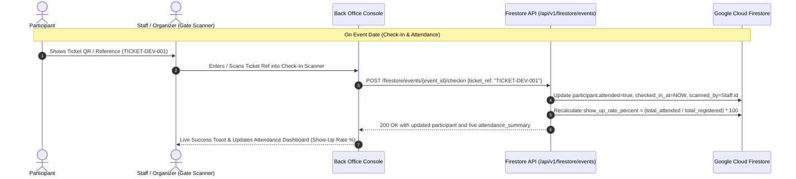

---

## Google Identity Services & Avatar Sync Sequence Diagram

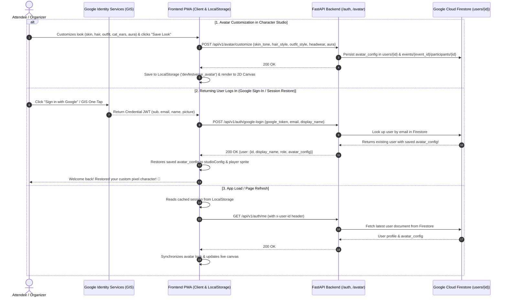

---

## AI Agenda Generation & Auto-Fill Architecture

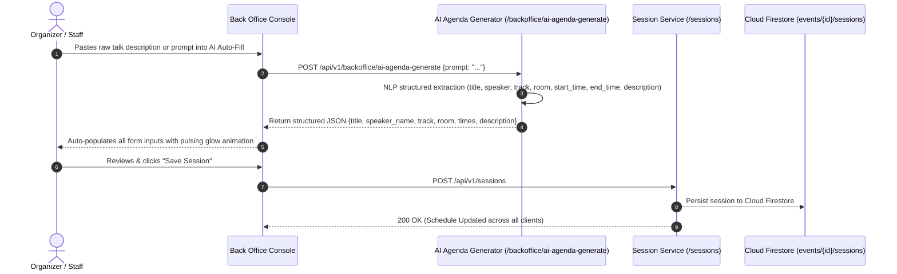

---

## Attendee Feedback & NPS Satisfaction Architecture

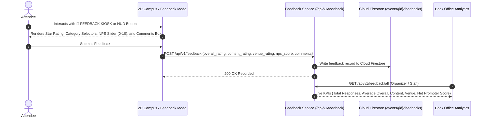

---

## Real-World Multiplayer Architecture (200+ Active Players)

To smoothly support 200+ concurrent players in the 2D world on Google Cloud Run with minimal latency and negligible bandwidth costs, DevFestVerse employs a multi-tiered real-time spatial networking architecture:

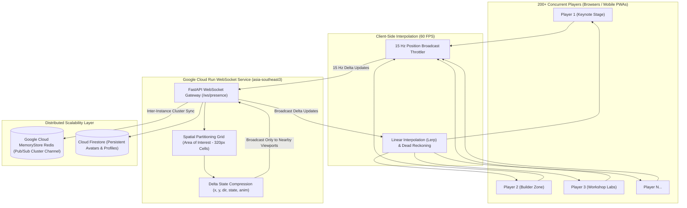

### Key Scaling Mechanisms:
1. **Spatial Partitioning (Area of Interest - AoI)**:
   - The campus is divided into $320\times 320\text{ px}$ grid quadrants.
   - Position deltas are broadcast exclusively to clients within the player's immediate and adjacent grid cells ($O(1)$ lookup), reducing global network traffic from $O(N^2)$ to $O(N)$.
2. **Delta Compression & 15 Hz Rate Throttling**:
   - Rather than broadcasting entire player objects every render tick (60 Hz), positions are throttled to 15 Hz with minimal 5-field delta payloads (`[x, y, dir, moving, avatar_hash]`).
3. **Client-Side Linear Interpolation (Lerp)**:
   - The client smoothly interpolates remote player coordinates across animation frames, creating a seamless 60 FPS visual experience with zero jitter.
4. **Inter-Instance Synchronization**:
   - Cloud Run instances scale horizontally with session affinity. When multiple container revisions run concurrently, inter-instance sync is relayed via **Google Cloud MemoryStore (Redis Pub/Sub)**.

---

## Canvas Stability & Error Boundary Architecture

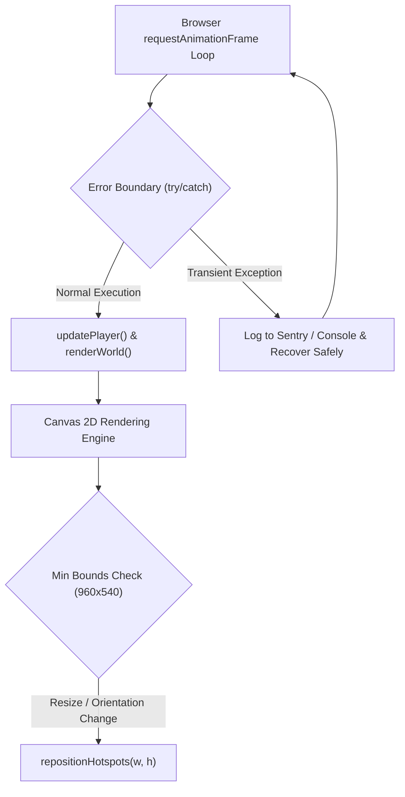

- **Render Loop Protection**: `gameLoop()` wraps all world rendering and player coordinate transforms inside a defensive error boundary, ensuring no uncaught runtime exceptions can ever terminate `requestAnimationFrame`.
- **Min Sizing Protection**: `resizeCanvas()` enforces a strict minimum viewport boundary ($960\times 540\text{ px}$) to prevent null/zero dimension collapses during browser minimize or modal transitions.
- **Automated Headless Canvas Test**: Verified via `frontend/tests/test_canvas_stability.js` executing 120+ continuous frames across 4 device viewports (Desktop, Laptop, Tablet, Mobile) with 0 failures.

---

## Builder Zone & Live Iframe Showcase Architecture

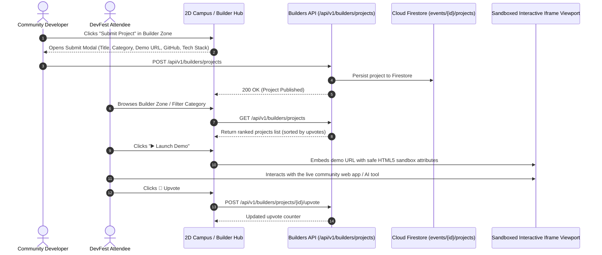

---

## Google Cloud Run Deployment Architecture

Deployed to **Google Cloud Platform (GCP)** with cost-optimized scaling to 0 and single instance capping.

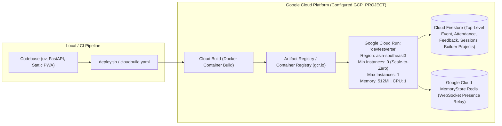

---

## Multi-Event Multi-Role RBAC Architecture

Users can participate in multiple concurrent Google Developer community events (e.g. DevFest, AI Hackathon, Cloud Community Day) with isolated roles, ticket numbers, and check-in statuses per event.

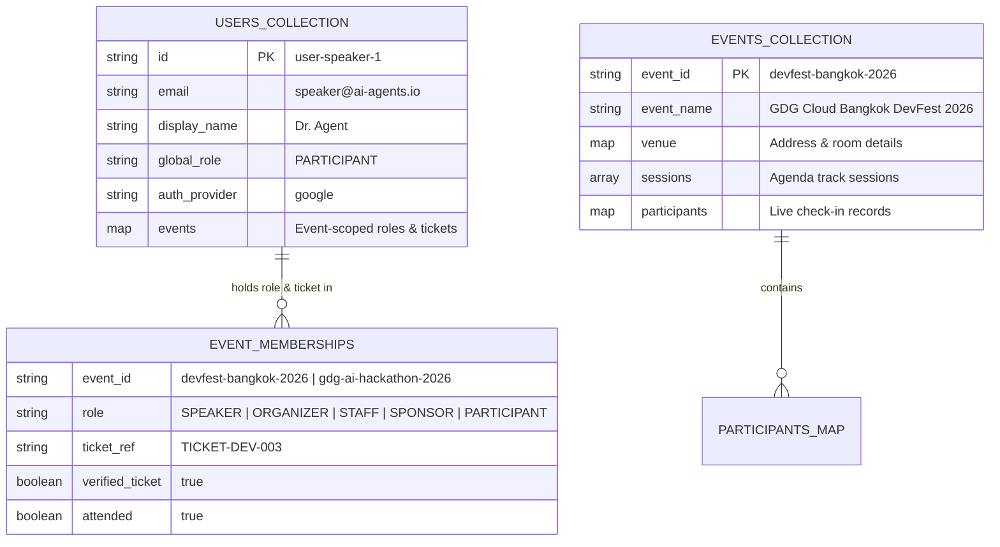

### Context-Aware Role Resolution Sequence

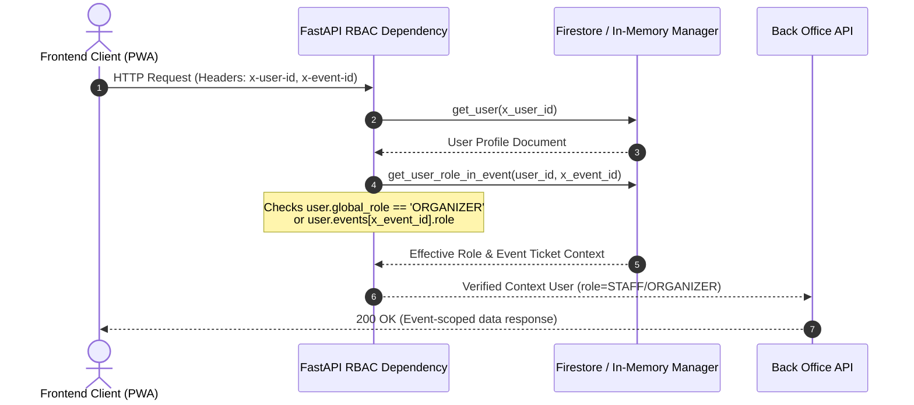

---

## API Permission Matrix & Anti-Privilege Escalation Security Model

To prevent privilege escalation, DevFestVerse employs strict defense-in-depth access controls:
1. **Self-Escalation Prevention**: Only existing `ORGANIZER` accounts can alter user roles or assign elevated roles. Non-organizers attempting to promote themselves receive `403 Forbidden`.
2. **Server-Side Token Validation**: Invitation links are single-use, randomly generated (`uuid4` cryptographically random tokens), bound to specific roles (`STAFF`, `SPEAKER`, `SPONSOR`), and strictly prohibit minting `ORGANIZER` links. Replay attempts are rejected with `400 Bad Request`.
3. **Immutable Realtime Presence State**: WebSocket position updates (`POSITION_UPDATE`) cannot mutate client `role` or `verified_ticket` properties. The server resolves authentic roles directly from Cloud Firestore upon connection.
4. **Isolated Event Contexts**: Role evaluations are context-scoped (`x-event-id`), preventing roles held in one event from granting permissions in another event unless the user holds global `ORGANIZER` status.

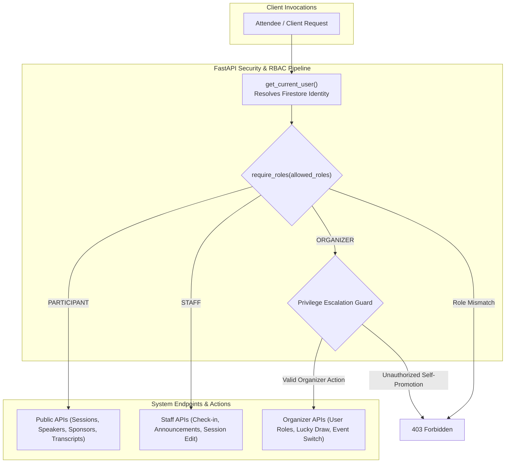

### Permission Matrix by Role

| Resource / Endpoint | `PARTICIPANT` | `SPEAKER` | `SPONSOR` | `STAFF` | `ORGANIZER` |
| :--- | :---: | :---: | :---: | :---: | :---: |
| **Browse Agenda & Venue Map** | ✅ | ✅ | ✅ | ✅ | ✅ |
| **Design / Save Avatar** | ✅ | ✅ | ✅ | ✅ | ✅ |
| **Submit / Upvote Q&A** | ✅ | ✅ | ✅ | ✅ | ✅ |
| **Submit / Upvote Builder Project** | ✅ | ✅ | ✅ | ✅ | ✅ |
| **Verify Official Ticket** | ✅ | ✅ | ✅ | ✅ | ✅ |
| **Reserve / Cancel Workshop** | ✅ | ✅ | ✅ | ✅ | ✅ |
| **Submit Feedback & NPS** | ✅ | ✅ | ✅ | ✅ | ✅ |
| **Edit Sponsor Booth** | ❌ | ❌ | ✅ (Own Booth) | ❌ | ✅ |
| **Check-In Attendees on Date** | ❌ | ❌ | ❌ | ✅ | ✅ |
| **Create / Edit Agenda Sessions** | ❌ | ❌ | ❌ | ✅ | ✅ |
| **AI Agenda Auto-Fill (CFP)** | ❌ | ❌ | ❌ | ✅ | ✅ |
| **Broadcast Announcements** | ❌ | ❌ | ❌ | ✅ | ✅ |
| **View Staff-Only Alerts** | ❌ | ❌ | ❌ | ✅ | ✅ |
| **View Attendee Feedback Analytics** | ❌ | ❌ | ❌ | ✅ | ✅ |
| **View User Directory & Stats** | ❌ | ❌ | ❌ | ✅ | ✅ |
| **Promote / Change User Roles** | ❌ | ❌ | ❌ | ❌ | ✅ |
| **Generate Role Invite Tokens** | ❌ | ❌ | ❌ | ❌ | ✅ |
| **Delete User from Firestore** | ❌ | ❌ | ❌ | ❌ | ✅ |
| **Trigger Lucky Draw Raffle** | ❌ | ❌ | ❌ | ❌ | ✅ |
| **Switch Active Event Global Context** | ❌ | ❌ | ❌ | ❌ | ✅ |

---

## Client-Side Firestore Caching & Mutation Invalidation Engine

To eliminate redundant reads and writes to Cloud Firestore, the web client employs a dual-tier caching layer (`sessionStorage` + in-memory fallback) with time-to-live (5-minute TTL) and automatic mutation-driven invalidation.

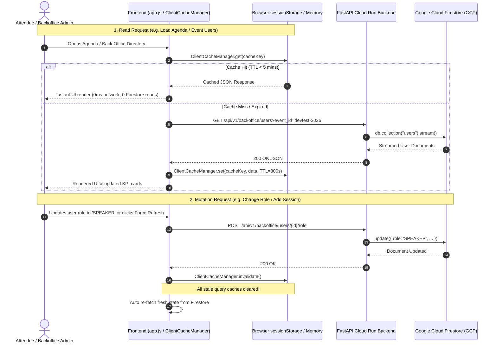

---

## Browser Local AI Character Generator Architecture

DevFestVerse allows users to generate compatible 2D pixel avatars using **Client-Side On-Device AI** directly within the browser without requiring external server calls:

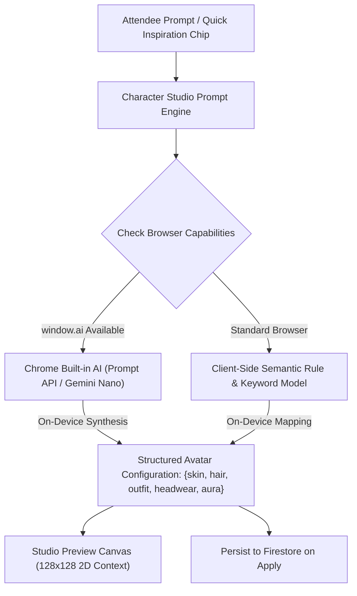

---

## Gemini 2.0 Unstructured Data Parsing Architecture

Organizers and staff can supply unstructured text (CFP submissions, talk abstracts, speaker bios, sponsor pitch decks, or company websites) and leverage **Google Gemini 2.0** to generate structured metadata:

```mermaid
sequenceDiagram
    autonumber
    actor Org as Organizer / Staff
    participant Client as Back Office Console
    participant SessionAPI as Session Service (/sessions/parse-gemini)
    participant SponsorAPI as Sponsor Service (/sponsors/parse-gemini)
    participant Gemini as Google Gemini 2.0 Flash / Vertex AI

    alt Parse Session Proposal
        Org->>Client: Pastes raw CFP abstract or email text
        Client->>SessionAPI: POST /api/v1/sessions/parse-gemini {raw_text}
        SessionAPI->>Gemini: Prompt structured JSON extraction (Title, Speaker, Bio, Track, Room, Times, Level, Takeaways)
        Gemini-->>SessionAPI: Clean structured session payload
        SessionAPI-->>Client: 200 OK
        Client-->>Org: Auto-populates all form inputs with glowing animation
    else Parse Sponsor Prospectus
        Org->>Client: Pastes company pitch or prospectus URL
        Client->>SponsorAPI: POST /api/v1/sponsors/parse-gemini {raw_text}
        SponsorAPI->>Gemini: Prompt structured extraction (Name, Tier, Tagline, Description, Iframe URL, Color, Swag, Roles)
        Gemini-->>SponsorAPI: Clean structured sponsor payload
        SponsorAPI-->>Client: 200 OK
        Client-->>Org: Auto-populates sponsor booth form & live iframe preview
    end
```

---

## Google Auth Platform Branding & Legal Compliance Architecture

To meet Google Cloud Identity Platform and OAuth 2.0 verification requirements, DevFestVerse hosts dedicated, customized branding and policy documents within the application:

```mermaid
graph TD
    subgraph GoogleOAuth ["Google Identity Platform"]
        OAuthScreen["OAuth Consent Screen Verification"]
        GooglePriv["Google Privacy Policy<br/>policies.google.com/privacy"]
        GoogleTerms["Google Terms of Service<br/>policies.google.com/terms"]
    end

    subgraph DevFestVerseApp ["DevFestVerse Platform (Hosted on Cloud Run)"]
        Landing["App Homepage: /"]
        PrivacyPage["Privacy Policy Page: /privacy"]
        TermsPage["Terms of Service Page: /terms"]
        SignInModal["Google Sign-In Modal<br/>(Embedded Compliance Links)"]
    end

    OAuthScreen -->|Verified App Home| Landing
    OAuthScreen -->|Verified Privacy URL| PrivacyPage
    OAuthScreen -->|Verified Terms URL| TermsPage
    
    SignInModal -->|Direct Link| PrivacyPage
    SignInModal -->|Direct Link| TermsPage
    PrivacyPage -.->|Governed by| GooglePriv
    TermsPage -.->|Governed by| GoogleTerms
```

---

## Verification & Test Plan

Automated test suites covering all microservice endpoints (**75 passed tests** via `uv run pytest`):
- `backend/tests/test_static_routes.py`: Tests root page serving, favicon, static assets, health check, **Hosted Privacy Policy (`/privacy`, `/privacy-policy`)**, and **Hosted Terms of Service (`/terms`, `/terms-of-service`)** including Google policy links verification.
- `backend/tests/test_avatar_auth.py`: Tests 2D avatar customization, Google sign-in integration, Gemini AI avatar synthesis, **Avatar Firestore Persistence & Re-Login Restore** (`test_avatar_restore_on_relogin`), and Firestore profile retrieval (`/auth/me`).
- `backend/tests/test_rbac_security.py`: Tests strict role-based access control, privilege escalation prevention, invitation link single-use enforcement, and context-aware permissions.
- `backend/tests/test_feedback.py`: Tests attendee feedback submission, category ratings, NPS calculations, organizer KPI summaries, per-event isolation, and per-event stage Q&A submission/upvoting.
- `backend/tests/test_sessions_transcribe.py`: Tests multi-track agenda filtering, favorites toggle, Gemini live transcript streaming, and **Gemini session proposal structured parsing** (`/sessions/parse-gemini`).
- `backend/tests/test_billboards_sponsors.py`: Tests community billboard links, sponsor booth configurations, and **Gemini sponsor prospectus structured parsing** (`/sponsors/parse-gemini`).
- `backend/tests/test_multi_event_rbac.py`: Tests multi-event role isolation, context-aware RBAC header resolution, event-scoped user listing, ticket linking, and event-specific role invite token redemption.
- `backend/tests/test_user_management.py`: Tests Google OAuth2 authentication token verification, Firestore user CRUD, and backoffice analytics.
- `backend/tests/test_frontend_canvas_integrity.py`: Automated headless Node.js canvas simulation testing 120+ animation frames and multi-resolution resizing with 0 errors.
- `backend/tests/test_realtime_presence.py`: Tests spatial partitioning grid (AoI) calculation, active player tracking, and cluster capacity stats.
- `backend/tests/test_builders.py`: Tests community project submission, track filtering, search, and upvote claps.
- `backend/tests/test_auth_invites.py`: Tests user registration, role promotion, and invitation link generation.
- `backend/tests/test_tickets.py`: Tests official ticket reference verification.
- `backend/tests/test_firestore_events.py`: Tests top-level Firestore event hierarchy, date/venue metadata updates, and participant check-in / live show-up rate calculations.
- `backend/tests/test_workshops.py`: Tests workshop seat capacity reservations and cancellation.
- `backend/tests/test_backoffice_apis.py`: Tests role changes, AI agenda prompt generation, active user tracking, and RBAC enforcement.

---

## 14. Balanced Venue Floorplan, Prominent Builder Zone & Customizable Booth Studio

### 14.1 Symmetrical & Collision-Free 2D Floorplan Architecture
To ensure high visual legibility and eliminate overlap across resolutions, the campus floorplan is partitioned into dedicated zones:
- **Top Center Keynote Stage**: Grand wooden keynote stage (`w/2 - 135` to `w/2 + 135`, `y: 16-104`) with stage podium and Google 4-color footlights.
- **Top Left Wing (Community Hub 1)**: `🌐 CHAPTER` (`gdg.community.dev`), `📘 FB PAGE`, `👥 FB GROUP`.
- **Top Right Wing (Community Hub 2)**: `💬 DISCORD`, `📷 INSTAGRAM`, `▶️ YOUTUBE`.
- **Centerpiece Pavilion (Builder Zone Hub)**: Centered at (`w/2 - 125, h/2 - 34`) with cyan cybernetic floor mat, animated corner laser brackets, and ambient holographic spotlight.
- **Left Flank**: `💻 WORKSHOP LABS` codelabs and AI hacking arena.
- **Right Flank**: `🏢 GOOGLE CLOUD BOOTH` & `🛍️ GDG SWAG SHOP` (LINE Shopping: `https://shop.line.me/@837etxse`).
- **Bottom Floor**: `🎫 TICKET VERIFY` & `📝 EVENT FEEDBACK` kiosks.
- **South-West Lounge**: Repositioned Lofi Coffee Lounge with velvet armchairs, wooden coffee table, laptop, and steaming cups (zero collisions).

```mermaid
flowchart TD
    subgraph VenueFloor ["Virtual Venue 2D Responsive Grid (Symmetrical Distribution)"]
        subgraph TopRow ["Top North Sector"]
            TL_Arcade["Top-Left Community Wing<br/>• 🌐 GDG Chapter<br/>• 📘 Facebook Page<br/>• 👥 Facebook Group"]
            StagePlatform["🏛️ Grand Keynote Stage & Screen<br/>(Centered: w/2 - 105, y: 32)<br/>• 🎤 MAIN STAGE AGENDA<br/>• Live Gemini Transcripts"]
            TR_Arcade["Top-Right Community Wing<br/>• 💬 Discord Server<br/>• 📷 Instagram<br/>• ▶️ YouTube Channel"]
        end

        subgraph MidRow ["Center Exhibition & Codelab Arena"]
            WS_Zone["💻 WORKSHOP LABS<br/>(Left Flank: x: 45, y: h/2 - 32)<br/>Hands-on Labs"]
            BZ_Hub["🛠️ BUILDER ZONE PAVILION<br/>(Centerpiece: w/2 - 125, y: h/2 - 34)<br/>• Neon Cyber Grid & Laser Corners<br/>• Community Web Apps & AI Demos<br/>• Built-in Live Iframe Runner"]
            RightBooths["Right Flank Pavilions<br/>• 🏢 Google Cloud Vertex AI Booth<br/>• 🛍️ GDG Swag & Merch Shop<br/>(LINE Shopping: @837etxse)"]
        end

        subgraph BottomRow ["South Entrance & Networking Floor"]
            LofiCafe["☕ Lofi Coffee & Beanbag Lounge<br/>(South-West: x: 235, y: h/2 + 35)<br/>Relaxed Networking Area"]
            TicketStation["🎫 TICKET VERIFY<br/>(x: w/2 - 205, y: h - 85)"]
            FeedbackStation["📝 EVENT FEEDBACK<br/>(x: w/2 + 20, y: h - 85)"]
        end
    end

    subgraph BoothCustomizer ["Customizable Booth Design Studio & LINE Shopping Module"]
        Presets["🎨 Quick Presets<br/>(Swag Shop, Title Sponsor, AI Sandbox, Arcade)"]
        CanvasPreview["Live 2D Sprite Preview Canvas<br/>(Realtime Color, Frame & Label Sync)"]
        DeployEngine["🚀 Dynamic Hotspot & DB Sync<br/>(/api/v1/sponsors & /api/v1/sponsors/generate-booth)"]
        LineShopping["🛍️ LINE Shopping Channel<br/>https://shop.line.me/@837etxse"]
    end

    Presets --> CanvasPreview
    CanvasPreview --> DeployEngine
    DeployEngine --> RightBooths
    RightBooths --> LineShopping
```

### 14.2 High-Legibility Typography & Glassmorphic UI Standards
- **Hotspot Bounding Boxes**: `bold 11px / 12px JetBrains Mono, monospace` (titles) and `bold 7.5px / 9.5px JetBrains Mono, monospace` (subtitles) with dynamic content-aware auto-padding.
- **Participant Overhead Name Tags**: `bold 11px JetBrains Mono, monospace` with dark translucent glass pill backgrounds (`rgba(11, 17, 33, 0.85)`).
- **Speech Bubbles**: `bold 11px JetBrains Mono, monospace` rendered with 28px ergonomic pill heights and generous padding.
- **Glassmorphic Proximity Hints**: Compact rounded pill badge (`0.72rem`, `border-radius: 20px`, `padding: 3px 10px`) with **12px backdrop blur** (`backdrop-filter: blur(12px) saturate(180%)`), subtle cyan border (`rgba(56, 189, 248, 0.4)`), and an embedded glowing keycap `<span class="hint-key">E</span>` that never blocks surrounding booths or characters.
