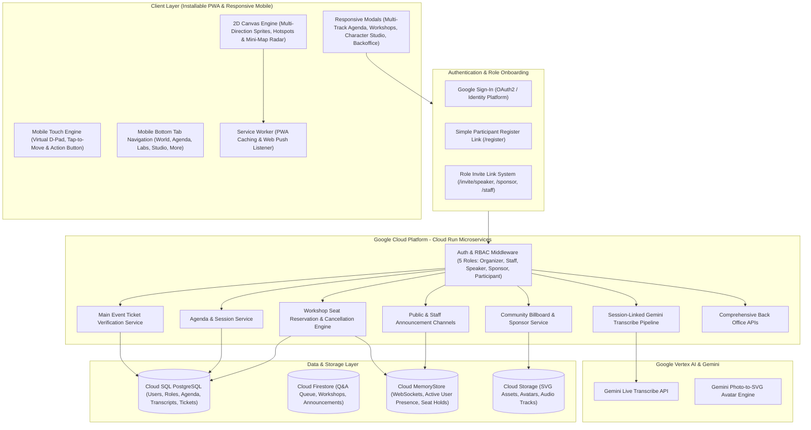
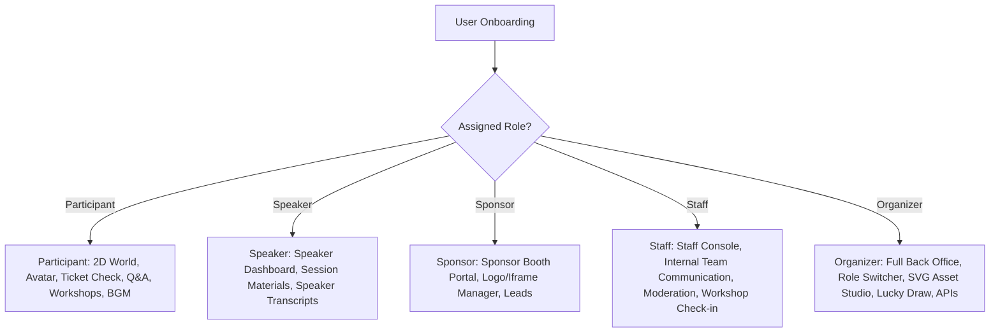
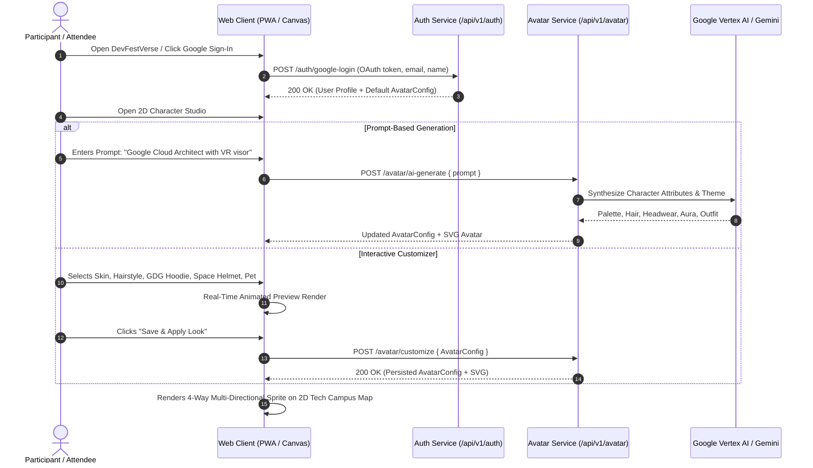
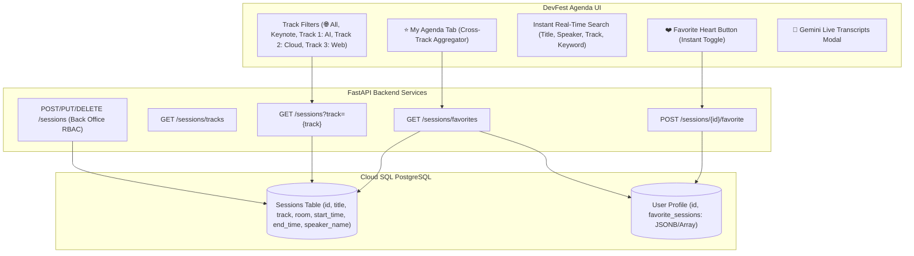
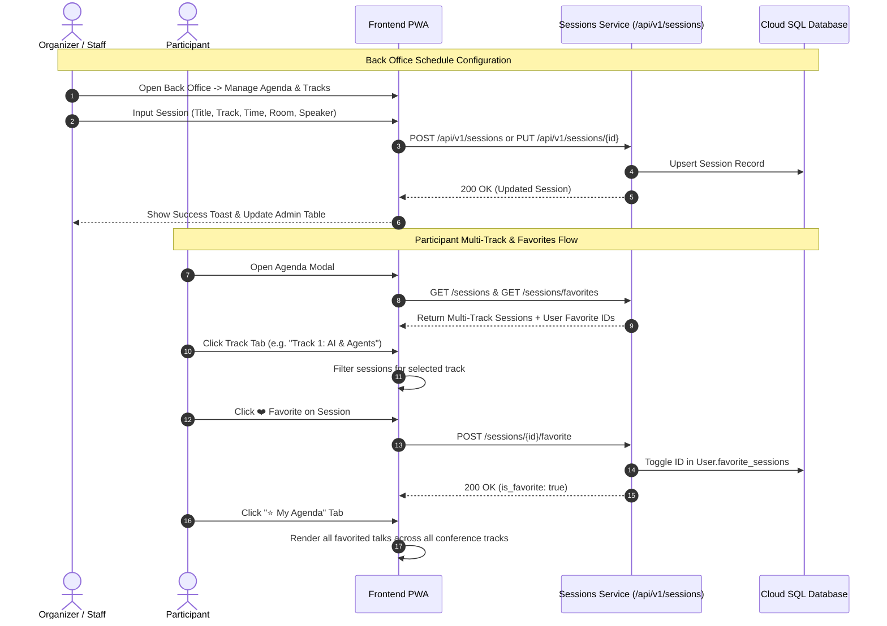

# Architecture & Technical Design Document - DevFestVerse

## Overview
**DevFestVerse** is an interactive 2D pixel-art virtual event platform built for **GDG Cloud Bangkok**. Deployed on **Google Cloud Platform (Cloud Run microservices)**, it provides an immersive retro game experience featuring custom SVG agent avatars with idle bobbing animations, GDG Cloud Bangkok community billboards (social links with embedded iframe modals & new tab buttons), sponsor booths, session-linked Gemini transcriptions by speaker, workshop room seat reservations, background music (YouTube/GCS audio), and role-based access control.

---

## High-Level System Architecture Diagram

---

## User Role Matrix (RBAC)

---

## Google Sign-In & Character Studio Onboarding Sequence

---

## Detailed Data Models & Entity Relationships

1. **User / Account (`users`)**:
   - `id`: UUID
   - `email`: String (Google OAuth)
   - `display_name`: String
   - `role`: Enum (`ORGANIZER`, `STAFF`, `SPEAKER`, `SPONSOR`, `PARTICIPANT`)
   - `verified_ticket`: Boolean (Status from Main Event Ticket Verification)
   - `ticket_ref`: String
   - `avatar_config`: JSON (`skin_tone`, `hair_style`, `hair_color`, `outfit_style`, `outfit_color`, `headwear`, `aura`, `theme`)
   - `avatar_svg`: Text (SVG avatar markup)
   - `created_at`: Timestamp

2. **Agenda Session (`sessions`)**:
   - `id`: UUID
   - `event_id`: UUID
   - `title`: String
   - `description`: Text
   - `speaker_id`: UUID (FK `users.id`)
   - `start_time`: Timestamp
   - `end_time`: Timestamp

3. **Session Transcript (`transcripts`)**:
   - `id`: UUID
   - `session_id`: UUID (FK `sessions.id`)
   - `speaker_id`: UUID (FK `users.id`)
   - `transcript_text`: Text
   - `original_language`: String (e.g. `th`, `en`)
   - `translated_text`: Text
   - `timestamp`: Timestamp

4. **Community Billboard & Sponsor (`billboards`)**:
   - `id`: UUID
   - `event_id`: UUID
   - `category`: Enum (`COMMUNITY_FACEBOOK_PAGE`, `COMMUNITY_FACEBOOK_GROUP`, `COMMUNITY_DISCORD`, `COMMUNITY_INSTAGRAM`, `COMMUNITY_YOUTUBE`, `SPONSOR`)
   - `title`: String
   - `logo_svg`: Text / URL
   - `iframe_url`: String
   - `description`: Text
   - `position_x`: Integer
   - `position_y`: Integer

5. **Workshop Room (`workshops`)**:
   - `id`: UUID
   - `event_id`: UUID
   - `title`: String
   - `speaker_name`: String
   - `capacity`: Integer
   - `reserved_count`: Integer
   - `room_code`: String

---

## Security & Authentication Flow
- **Google OAuth2 & Identity Integration**: User authenticates with Google Identity Services; backend synchronizes user account and avatar configuration.
- **Invitation Token Validation**: Organizers generate HMAC-signed token URLs (`/invite/speaker?token=...`, `/invite/sponsor?token=...`, `/invite/staff?token=...`). Redemption validates signature and updates user role in DB.

---

## Multi-Track Agenda & Personalized "My Agenda" Architecture

### Multi-Track & Back Office Flow Sequence

---

## Verification & Test Plan

Automated test suites covering all microservice endpoints:
- `backend/tests/test_auth_invites.py`: Tests user registration, role promotion, and invitation link generation.
- `backend/tests/test_tickets.py`: Tests official ticket reference verification.
- `backend/tests/test_billboards_sponsors.py`: Tests community billboard links and sponsor booth configurations.
- `backend/tests/test_workshops.py`: Tests workshop seat capacity reservations and cancellation.
- `backend/tests/test_sessions_transcribe.py`: Tests multi-track agenda filtering, favorites toggle, backoffice session CRUD, and Gemini transcript streaming.
- `backend/tests/test_backoffice_apis.py`: Tests role changes, lessons learned retrospectives, active user tracking, and RBAC enforcement.
- `backend/tests/test_avatar_auth.py`: Tests 2D avatar customization, Google sign-in integration, and Gemini AI avatar synthesis.

