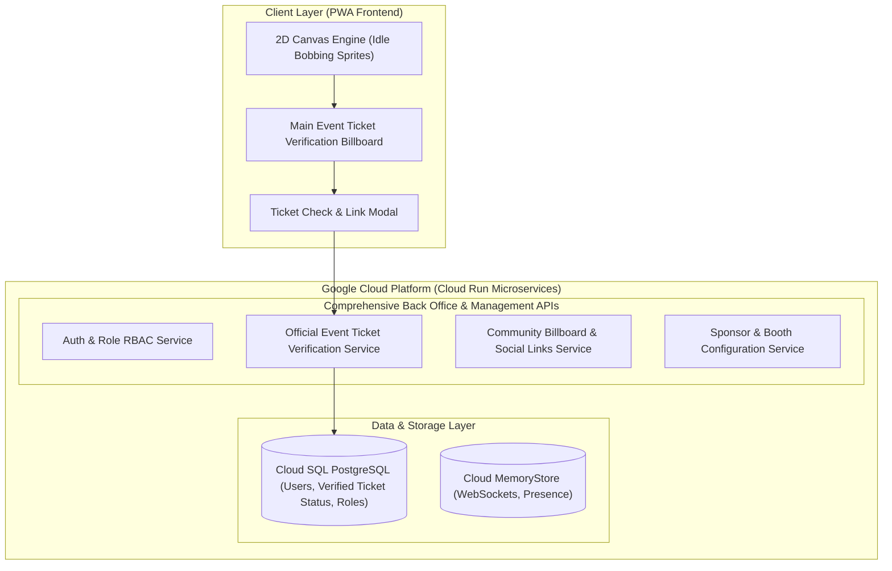

# SPEC & Product Requirement Specification: DevFestVerse - GDG Cloud Bangkok

## Executive Overview
**DevFestVerse** is an interactive, gamified 2D pixel-art virtual event platform built for **GDG Cloud Bangkok**. The platform immerses participants in a retro game-like interface themed around AI Agents. Participants join seamlessly via a **Simple Participant Register Link** (or 1-click Google Sign-In), verify their official event tickets at the **Main Event Ticket Verification Billboard**, explore a 2D map with idle bobbing pixel avatars, interact with stage sessions, explore **GDG Cloud Bangkok Community Billboards** and **Sponsor Billboards & Booths** (viewable via embedded `iframe` modals with an explicit **"Open in New Tab"** button), register for **Workshop Rooms**, listen to **Background Music (BGM)**, engage in real-time Q&A, submit feedback, share event photos, join lucky draws, and access live transcription/translation powered by Gemini.

---

## Priority Focus Matrix

```
┌─────────────────────────────────────────────────────────────────────────┐
│ Priority 1 (Core Focus): 2D Interaction, Community & Sponsor Space      │
│ • Simple Participant Register Link / Google 1-Click Join               │
│ • Main Event Ticket Verification Billboard (Verify official DevFest     │
│   ticket & unlock Verified Badge / Lucky Draw eligibility)             │
│ • Role Invitation Link System (Speakers, Sponsors, Staff)              │
│ • Idle bobbing 2D pixel character sprite animations (up/down bounce)   │
│ • GDG Cloud Bangkok Community Billboard Zone (Facebook Page, Group,     │
│   Discord, Instagram, YouTube)                                          │
│ • Interactive Sponsor Billboards & Sponsor Booths                      │
│ • Billboard UX: Opens embedded iframe view modal first +               │
│   "Open in New Tab" button in modal header                              │
│ • Back Office Management for Billboards, Tickets & Sponsor Booths       │
├─────────────────────────────────────────────────────────────────────────┤
│ Priority 2: Core Event Features & Session Transcriptions               │
│ • Photo-to-SVG Agent Avatar Generator (Gemini)                         │
│ • Agenda HUD & Community Shop iframe                                   │
│ • Gemini Live Audio Transcription linked to Session & Speaker          │
│ • Realtime Q&A Queue with Back Office Control                          │
│ • Participant Feedback & Photo Sharing Board                           │
├─────────────────────────────────────────────────────────────────────────┤
│ Priority 3: Operations, Roles & Comprehensive Back Office APIs          │
│ • Role-Based Access Control (Organizers, Staff, Speakers, Sponsors,     │
│   Participants) with Role Invitation Links & Back Office Role Switcher  │
│ • Comprehensive Back Office APIs for Organizers & Staff                │
│ • Back Office Active User presence, Announcements & Lucky Draw         │
│ • Workshop Room Registration System                                    │
│ • Multi-Event Archiving & SVG Asset Studio                             │
├─────────────────────────────────────────────────────────────────────────┤
│ Priority 4 (Secondary): Audio & Streaming Features                     │
│ • Background Music (YouTube URL embed support + GCS Audio)             │
│ • Gemini Live Translation                                              │
└─────────────────────────────────────────────────────────────────────────┘
```

---

## Technical Architecture Overview



---

## Detailed Functional Requirements

### 1. Main Event Ticket Verification Billboard System (Priority 1)
- **Main Entrance Billboard:** Prominent 2D billboard located at the central spawn point of the 2D world map.
- **Official Ticket Verification Flow:** Interacting opens the Ticket Verification Modal, prompting participants to input their official DevFest Event Ticket reference ID/email or click the official DevFest registration link.
- **Verified Ticket Privileges:** Displays an exclusive "Verified Ticket" icon badge above the participant's 2D pixel avatar and gates entry to the Lucky Draw & priority Workshop seats.

### 2. Simple Participant Register Link & Role Invite System
- **Participant Registration:** Simple register link (`/register` or `/join`) with 1-click Google Sign-In or quick name entry.
- **Role Invitation Link System:** Dedicated invite links generated by Organizers in Back Office (`/invite/speaker`, `/invite/sponsor`, `/invite/staff`).

### 3. Clickable Billboard UX & iframe View Modal (Priority 1)
- Clicking/interacting with any Billboard opens an embedded `iframe` view modal first with an explicit **"Open in New Tab"** button.
- GDG Cloud Bangkok Social Channels: Facebook Page, Facebook Group, Discord, Instagram, YouTube.
- Sponsor Billboards & Booths.

### 4. Expanded Role-Based Access Control (RBAC) & Back Office APIs
- Roles: **Organizers**, **Staff**, **Speakers**, **Sponsors**, **Participants**.
- Comprehensive Back Office APIs for full system control.

### 5. Core 2D User Interaction & Pixel Avatar (Priority 1)
- Character sprite bobs up and down continuously when idle.
- Gemini Avatar Generator: Photo -> Gemini API + SVG Engine -> 2D SVG pixel agent avatar.

### 6. Session-Linked Gemini Transcriptions by Speaker
- Audio stream -> Gemini Live API -> Stage HUD captions -> Transcripts saved by Session ID and Speaker ID.

### 7. Workshop Room Registration System
- Interactive Workshop rooms on 2D map with real-time seat reservation engine.

### 8. Background Music (BGM) System
- YouTube URL embed support + GCS audio tracks with HUD volume controls.

---

## Implementation Plan Overview

1. **Backend Infrastructure**: Python 3.13+ with FastAPI managed via `uv`.
2. **Frontend Architecture**: PWA with Service Worker (`sw.js`), HTML5 Canvas/SVG engine, and Web Push notifications.
3. **Database Layer**: Cloud SQL PostgreSQL, Cloud Firestore, Cloud MemoryStore Redis.
4. **Verification**: Automated test suite powered by `pytest` (`uv run pytest`).
